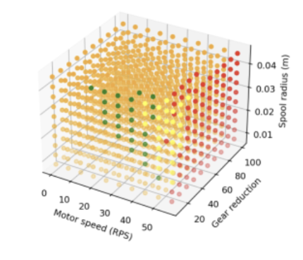

# BLiMS (Brake Line Manipulation System)

<figure class="center-figure">
    
    <figcaption></figcaption>
</figure>

BLiMS, the **B**rake **Li**ne **M**anipulation **S**ystem, is a parachute guidance system I designed and built for the Cornell Rocketry Team's 2025 rocket. By pulling on the brakelines of a rectangular parafoil, BLiMS navigates the team's 19 foot long, 150 lb rocket to a GPS waypoint as it a descends from a 10,000' apogee.

BLiMS has flown 4 times on two different high-powered rocket platforms (2x on our competition rocket, 2x on an L3 rocket created by former CRT member Sam Noles). The most succesful flight saw BLiMS perform succesful left and right banks at a variety of angles from a launch of ~5,000 ft. BLiMS has 2 more characterization flights planned for early 2026, before final installation in our competition rocket for the 2026 Spaceport America Cup.

## System Overview

*A detailed, 50-page technical report is availible at the bottom of this page going into every aspect of the design and validation of BLiMS. I recommend checking that out for further insight into the project.*

BLiMS is basically a miniature skydiver. Onboard, it has a single high-power BLDC motor connected to a pair of counter-rotating spools to extend and retract the brakelines of our rocket's rectangular parafoil. When the brakelines are pulled, the shape of parafoil changes allowing for left and right turns. An onboard PID controller uses GPS and altimiter data to guide the rocket to a predetermined landing point. Given the weight of the rocket and extreme deceleration during parachute inflation, BLiMS was deisgned to withstand **>4,500 lbs** of loading while still retaining complete control over the parachute. 

I designed the entire mechanical system, as well as simuluated and selected the motors, motor drivers, and battery systems. Other members of CRT wrote the firmware, controller, and machined the actual components.

BLiMS was designed in the spring and summer of 2024. It was revised that fall, after which it was manufactured and assembled. It flew succesfully for the first time in January 2025 on our L3 test platform (developed by former member Sam Noles). A second validation flight was launched in March of 2025, where we succesfully turned the rocket several times allowing us to tune the controller. Two additional flights on our competition launch vehicle took place in Penn Yann, NY (April '25) and Midland, TX (June '25) where a new parachute deployment system was tested and refined. Photos and videos of BLiMS working are below. 

At least 4 more flights are planned for BLiMS in 2026.

## Mechanical

BLiMS uses the following components:
- Motor: ODrive D6374 150KV BLDC
- Motor Driver: ODrive Pro
- Motor Encoder: 16384 CPR Absolute RS485 Encoder (AMT212B-V-OD)
- Batteries: 9x 18650 Molicel P28A Li-Ion Cells
- Gearing: 10:1 Worm Gear and Worm
- Parachute: Firebird Rush 110 Reserve Parachute

Detailed descriptions for how the system works are availible in the Technical Report at the end. The system were designed in CAD (Fusion360 and Solidworks), simulated and verified with Ansys, manufactured on a mix of manual and CNC mills, and tested on several high powered sounding rockets. 

## Photos of System

<figure class="center-figure">
    
    <figcaption>Photo of the assembled BLiMS</figcaption>
</figure>

<figure class="center-figure">
    
    <figcaption>CAD cross section of BLiMS</figcaption>
</figure>

<figure class="center-figure">
    
    <figcaption>Custom python simulation of BLDC motor</figcaption>
</figure>

<figure class="center-figure">
    
    <figcaption>BLiMS connected to the parachute</figcaption>
</figure>

<figure class="center-figure">
    
    <figcaption></figcaption>
</figure>

## Photos from Test Launches

<figure class="center-figure">
    
    <figcaption>Installing BLiMS into the rocket</figcaption>
</figure>

<figure class="center-figure">
    
    <figcaption>BLiMS loaded into the airframe</figcaption>
</figure>

<figure class="center-figure">
    
    <figcaption>Carrying the rocket to the launch pad</figcaption>
</figure>

<figure class="center-figure">
    
    <figcaption>Rocket on the rail prior to launch</figcaption>
</figure>

<figure class="center-video">
    <video controls autoplay loop muted>
    <source src="blims_launch_2.mp4" type="video/mp4">
    Your browser does not support the HTML5 Video element.
    </video>
    <figcaption>Rocket launch</figcaption>
</figure>

<figure class="center-figure">
    
    <figcaption>L3 Launch #1 GPS Data</figcaption>
</figure>

<figure class="center-figure">
    
    <figcaption>L3 Launch #2 GPS Data</figcaption>
</figure>

## Technical Report

Below is a detailed technical report I wrote for BLiMS, which dives deeper into the simulation and mechanical/electrical design.

<object data="blims_tech_report.pdf" type="application/pdf" width="500px" height="700px">
    <embed src="blims_tech_report.pdf">
        
This browser does not support PDFs. Please download the PDF to view it: <a href="blims_tech_report.pdf">Download PDF</a>.

    </embed>
</object>