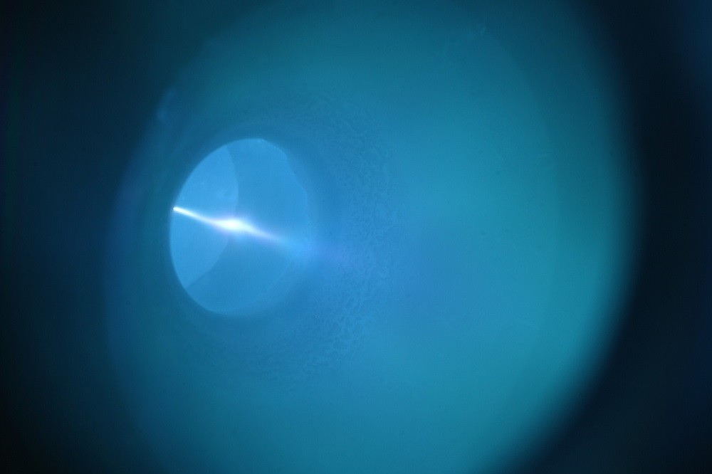
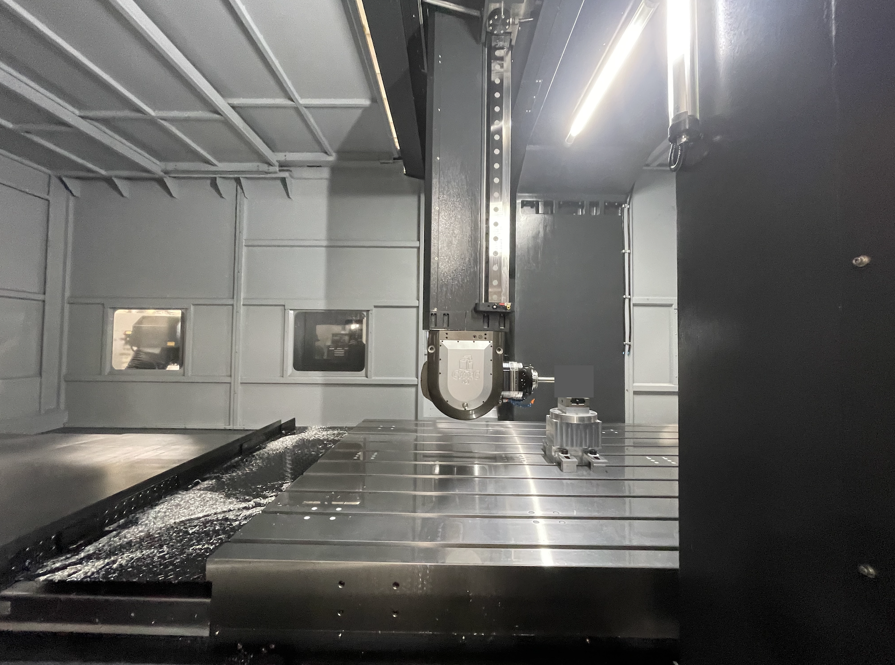

# EUV/VUV Plasma Discharge Source Characterization for Semiconductor Metrology

<figure class="center-figure">
    
    <figcaption>Discharge plasma at Fraunhofer ILT</figcaption>
</figure>

During summer '25, I worked at [KLA](https://www.kla.com/) on the broadband plasma (BBP) team under Larissa Juschkin. Throughout the summer I designed, manfuactured, and assembled two plasma characterization tools to measure the timing and emission of EUV/VUV discharge plasmas.

I then travelled to Fraunhofer ILT in Aachen, Germany for several weeks to install and operate my tools on a broadband plasma discharge source.

## Technical Background
### Industry Motivation
As transistors approach single-digit atomic sizes, characterization of the transistors and the interconnects joining them becomes increasing challenging. While tools (i.e. e-beam microscopes) capable of measuring features this small have existed for decades, they are slow and stand no chance in the hundred-wafer-per-hour production environment that modern fabs demand. This leaves optical inspection (using photons rather than electrons or ions) as the only commerically-feasible solution to future microchip characterization. 

Optical wavelengths (400-750 nm) are far too big to measure transistor defects. For the last few decades, DUV (200-300 nm) generated by excimer lasers has proved sufficient to characterize defects down to double-digit nms. However, even this light is too large for modern nodes. The BBP team I was part of at KLA is searching for light sources that emit shorter wavelengths with high enough intensity to be used in production environments, while also being durable enough to last a decade in production.

### Discharge Plasmas
Dishcarge plasmas rely on high capacitance, ultra-low-inductance capacitors to form sparks (strands of hot plasma) in an pure gas enviornment. This conductive arc allows additional current to flow, which itself generates a magnetic field that compresses the plasma, further heating it up (z-pinch). The result is an extremly hot (200,000K) plasma whose radiation includes substial EUV (13.5 nm) and VUV (100-200 nm). 

While technologically quite simple, discharge sources suffer from the proximity of ultra-hot plasmas to their electrodes (which results in accelerated degradation of plasma shape and EUV/VUV yield). My work was concerned with characterizing an existing 

## Technical Details
I designed, manufactured, and installed two plasma characterization tools, each roughly the size of a fist. 

Both systems went through multiple design cycles with mechanical engineers, research scientists, and plasma physicists to ensure they would perform in the harsh EUV/VUV environment. Both devices contained several metal machined, optical, sintered ceramic, electrical, and 3D printed components. I also made my own high-voltage power supplies for the internal electronics.

I personally managed manfacturing of the components at local machine shops, working directly with machinists on the shop floor to tweak device parameters to hit the extremly rapid turn-around-time of the project.

<figure class="center-figure">
    
    <figcaption>Local machine shop's 5 axis CNC mill</figcaption>
</figure>

## Operation
I worked in Aachen, Germany (southern end of the border between Germany and the Netherlands) for two weeks, installing and then operating the devices over the course of a two week measurement campaign with one other KLA colleague. I took thousands of measurements with both devices, which operated perfectly throughout the entire campaign. I also assisted in operating several other optical, irradiance, and electrical characterization tools also mounted on the plasma source.

## Transportation

I was working at KLA in California. However, the discharge source of interest was located in Germany. This meant we had to cross a continent and an ocean with all the equipment and tools needed for several weeks of cleanroom work in a plasma physica laboratory. 

I  managed the entire packing and transportation of all equipment and supporting tools between California and Germany. This included custom shipping hardware to prevent damage during transportation, working directly with TSA to approve on-flight transportation, and meeting with German lab managers ahead of time to come up with imperial-to-metric workarounds for certain equipment. 

<figure class="center-figure">
    
    <figcaption>Modified aluminum carry case with half a dozen Shockwatches</figcaption>
</figure>

## Other Projects
In addition to my two main devices, I also worked on several other projects:
- Vacuum-compatable high voltage (several kV) plasma triggers
- 8020 framing hardware for a large laser test bench
- Low intensity VUV exposure bench system design
- Redesign and assembly of plasma imaging tubes