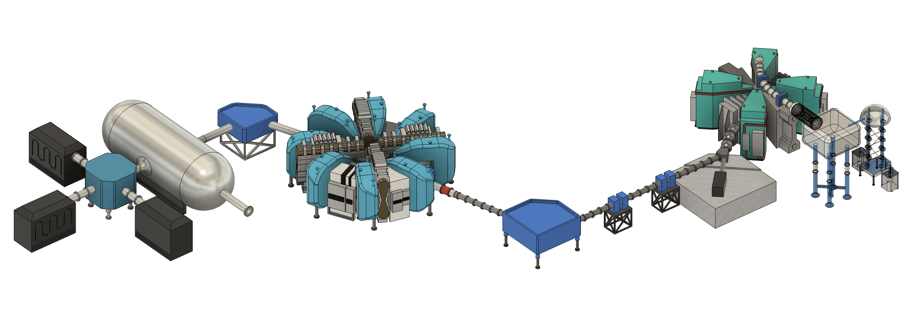

# Redesigning the Proton Accelerator at PSI for Muon Catalyzed Fusion

I redesigned the proton accelerator used at PSI (a muon research facility in Switzerland) to generate negative muons which can be used for muon catalyzed fusion to produce energy.

<figure class="center-figure-medium">
    
    <figcaption>Complete assembly of all subsystems of my design</figcaption>
</figure>

## Project Background
In spring of 2026, Himani Mishra and I took David Hammer's "Intro to Controlled Fusion" (ECE 4840) course at Cornell, which introduces the physics and basic architectures for fusion energy reactors. Rather than present on an existing company (as the project guidlines said we should), Himani and I decided to produce our own, new work for our final project. Himani used Geant4 (particle transport simulation toolkit developed by CERN) to model muon catalyzed dueterium-tritium reactions, and I redesigned the proton accelerator used at PSI (muon research facility in Switzerland) for muon catalyzed fusion.

<figure class="center-figure">
    
    <figcaption>Top down view of complete assembly</figcaption>
</figure>

## What is Muon Catalyzed Fusion?
There are two kinds of nuclear energy: fission and fusion. Fission is what we're all familiar with; large atoms (uranium, etc...) radioactively decay into smaller atoms, and release energy in the process. Fission reactors have been around for 5+ decades, and have become synonymous with "nuclear energy."

However, there is a second kind of nuclear energy: fusion. Rather than splitting large atoms into smaller ones, you can go in the opposite direction, combining small atoms into larger ones. This reaction releases substantially more energy than fission, and uses commonly occuring materials (like hydrogen). It also avoids many of the safety concerns associated with fission.

The most common fusion reactor architectures uses extremely high temperatures (100+ million Kelvin) to kinetically force reactants together, resulting in fusion. This approach requires unfathomably complex plasma confinement reactors (MCF) or lasers (ICF) to sustain these temperatures for sufficient time to produce power. 

However, there is an alternative. Muons are subatomic particles which behave similarly to electrons, but they weigh ~200 times more and only last 2.2 μs. When injected into a dueterium-tritium mixture (two isotopes of hydrogen), muons can displace electrons orbiting tritium, and thanks to their larger mass, shrink the tritium's bonding distance by ~200 times. As a result, this "muonic tritium" can spontaneously fuse with a nearby dueterium atom, releasing the exact same amount of energy as a non-muonic DT fusion reaction. This whole process occurs near room temperature, avoiding a vast majority of the engineering challenges associated with traditional fusion architectures.

Unfortunately, this "muon catalyzed fusion" has a few fundemental physical barriers which prevents it from being energy net positive, and thus commercially viable. Nonetheless, it is a rich field, hence our study of it for this project.

## Model Inspiration
The Paul Scherrer Institute (PSI) in Würenlingen, Switzerland is the world's leading muon research facility. To produce muons, they shoot high energy protons from a particle accelerator at a graphite target, producing pions (another subatomic particle) which rapidly decay into muons. However, due to their specific target's architecture, PSI's muons are the wrong charge for muon catalyzed fusion. I therefore redesigned, in CAD, PSI's particle accelerator and target to produce muons compatible with muon catalyzed fusion.

Everything in the CAD was made by me. The model is a mix of artist rendition and actual, research-driven designs. While this proposed muon source would almost certainly not be capable of net-positive fusion, it does represent a novel adaptation of leading muon generation technology for muon catalyzed fusion. 

## Subsystems
The proposed muon source begins with a small, microwave-based proton source inside a Cockcroft-Walton accelerator. This pre-accelerator stage not only generates the protons which will ultimately go on to collide with the target, but it uses the Cockcroft-Walton voltage source to accelerate the protons up to sufficient energy to move into the next stage; the injector. This second “injector” stage is a small, isochronous separated sector cyclotron which accelerates the low energy protons generated in the Cockcroft-Walton accelerator up to a moderate energy. These protons are then transferred via a proton beamline, focused by intermittent pairs of quadrupole magnets and steered by dipole magnets, to the final stage of acceleration: the primary accelerator. This large, isochronous separated sector cyclotron (same architecture as the injector) provides the protons with their remaining energy, bringing them to a total energy of ~590 MeV. These high energy protons are at last focused on a target, where their collisions generate pions which rapidly decay into muons. These muons are then fed to a DT reactor (like a diamond anvil cell, which Himani researched in her section). Power from the still-energetic proton beam is recovered after the target via multiple large beam dumps.

### Cockcroft-Walton Accelerator

<figure class="center-figure-medium">
    
    <figcaption></figcaption>
</figure>

Closeup of the Cockcroft-Walton pre-accelerator. The system is 10 meters wide, 9 meters deep, and 8 meters tall. It uses a Cockcroft-Walton voltage multiplier to generate a large DC potential (~810 kV) between the proton source (inside the large silver box) and the rest of the accelerator. This potential accelerates protons to sufficient energy to enter the injector cyclotron. 

### Injector Cyclotron

<figure class="center-figure-medium">
    
    <figcaption></figcaption>
</figure>

Closeup of the injector cyclotron. Protons enter (from the Cockcroft-Walton) via the silver tube (top right). They are redirected down into the center of the injector via the dark grey tower (center). Protons orbit the cyclotron, accelerated by the RF resonators and guided by the magnets (teal wedges). Protons exit via the silver tube, supported by a concrete beam dump pad (bottom right).

### Transfer Beamline

<figure class="center-figure-medium">
    
    <figcaption></figcaption>
</figure>

Closeup of the transfer beamline optics. In this configuration, particles enter (from the injector) via the right tube and exit (to the primary accelerator) out the left tube. This configuration has a 31 meter beam path length. However, other beamline configurations (adapted to site-specific details) may be larger or shorter.

The small blue boxes are pairs of quadrapolar magnets, which compress the beam horizontally and vertically to prevent beam divergence. The large blue boxe is a dipolar magnet which allows the beam to be steered around corners.

### Primary Cyclotron

<figure class="center-figure-medium">
    
    <figcaption></figcaption>
</figure>

Closeup of the primary accelerator. Protons enter via the red and silver tube (left). The cyclotron itself has an outer diameter of 15.5 meters. Accelerated protons exit via the tube on the left. Notice the dipolar steering magnet (blue) allowing the beam to bend in the final direction of the target. Protons exit the primary accelerator with ~0.5 GeV of energy. 

### Target

<figure class="center-figure-medium">
    
    <figcaption></figcaption>
</figure>

Closeup of the target. Protons enter via the back of the vacuum chamber (see the corner of the entrance tube in the top right). The carbon, pion-producing targets live inside the steel chamber. Muons exit via flange (bottom right) to an MCF reaction chamber, such as the diamond-anvil cell proposed by Himani (not shown). The vacuum chamber (large steel cylinder) is 15.5 m long, and 5.5 m in diameter.

## Final Presentation
Below is our final report. It begins with Himani's Geant4 DT fusion sims, and then covers each subsystem of my CAD.

Note! My slides actually have 3D animations between each section of the CAD. Click on the photos to access the video animations.

<object data="Presentation Submission - Muon Catalyzed Fusion - Himani Mishra and Thomas Rimer.pdf" type="application/pdf" width="500px" height="350px">
    <embed src="Presentation Submission - Muon Catalyzed Fusion - Himani Mishra and Thomas Rimer.pdf">
        
This browser does not support PDFs. Please download the PDF to view it: <a href="Presentation Submission - Muon Catalyzed Fusion - Himani Mishra and Thomas Rimer.pdf">Download PDF</a>.

    </embed>
</object>

## Final Report
Below is our final report. It begins with a (more detailed) introduction to muon catalyzed fusion, then Himani's section, and finally my section. Each subsystem of my CAD has detailed technical analysis justifying the design and explaining proton flow. 

<object data="Muon Catalyzed Fusion - Himani Mishra and Thomas Rimer.pdf" type="application/pdf" width="500px" height="700px">
    <embed src="Muon Catalyzed Fusion - Himani Mishra and Thomas Rimer.pdf">
        
This browser does not support PDFs. Please download the PDF to view it: <a href="Muon Catalyzed Fusion - Himani Mishra and Thomas Rimer.pdf">Download PDF</a>.

    </embed>
</object>
