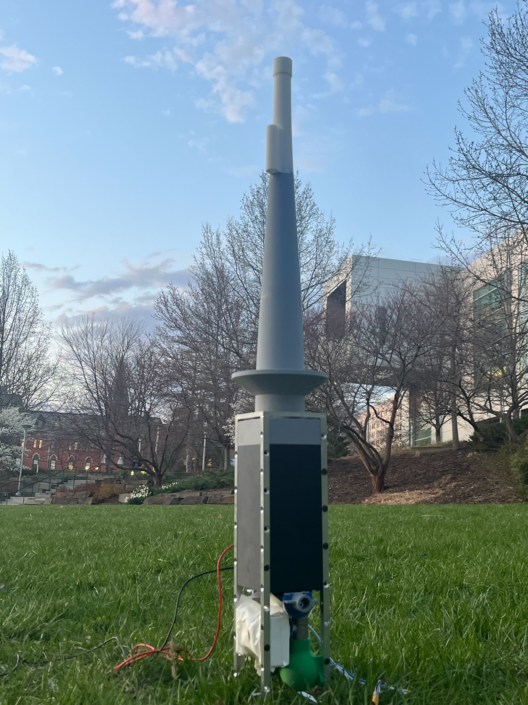
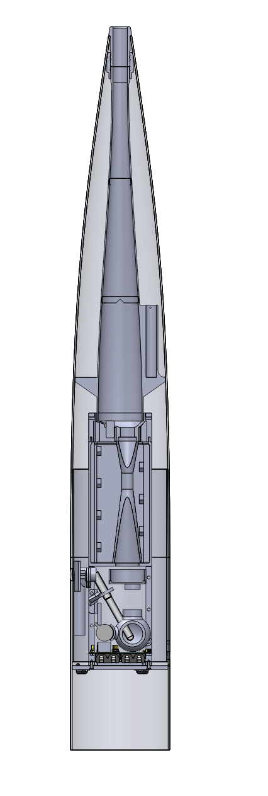
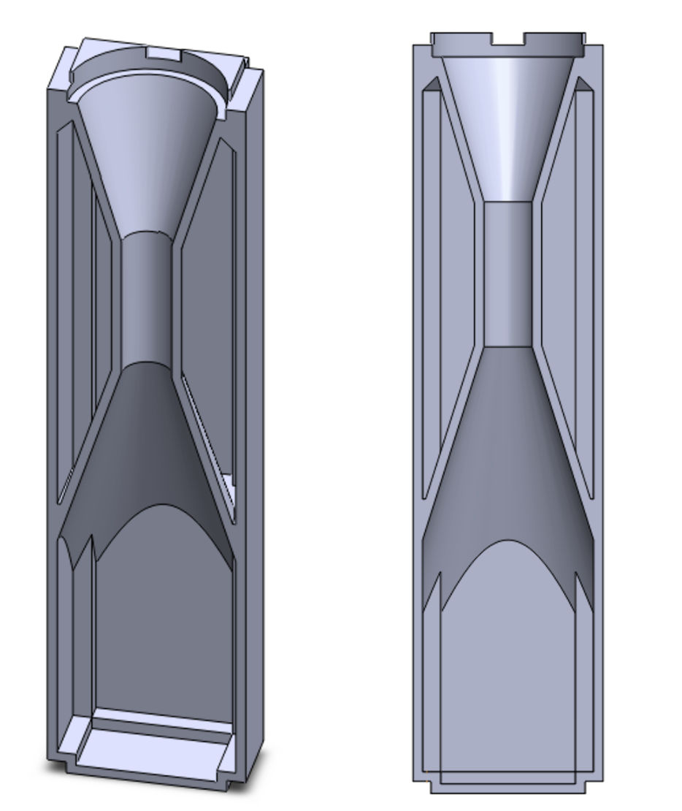
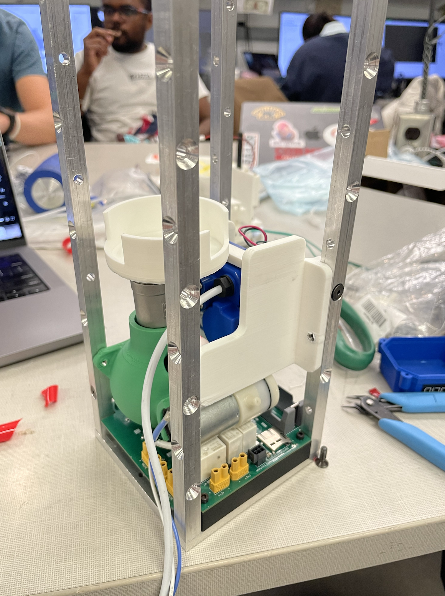
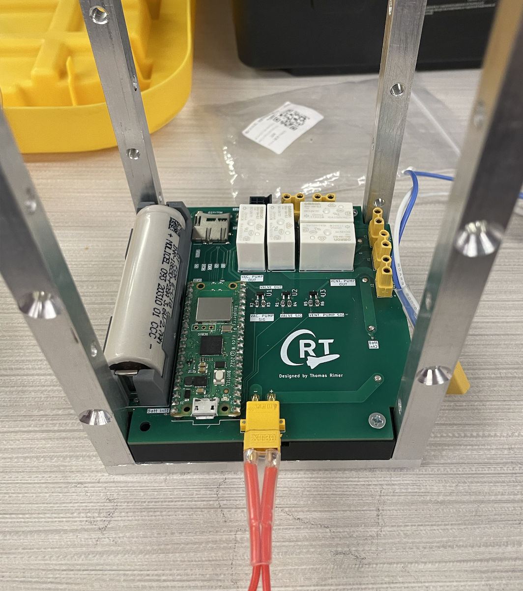
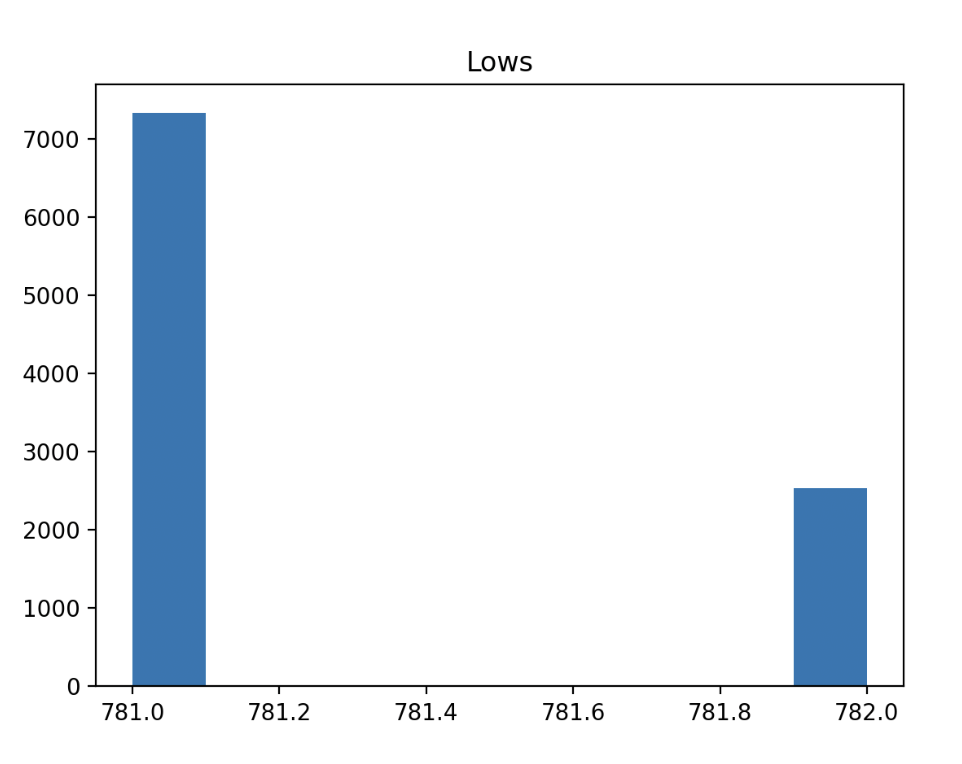
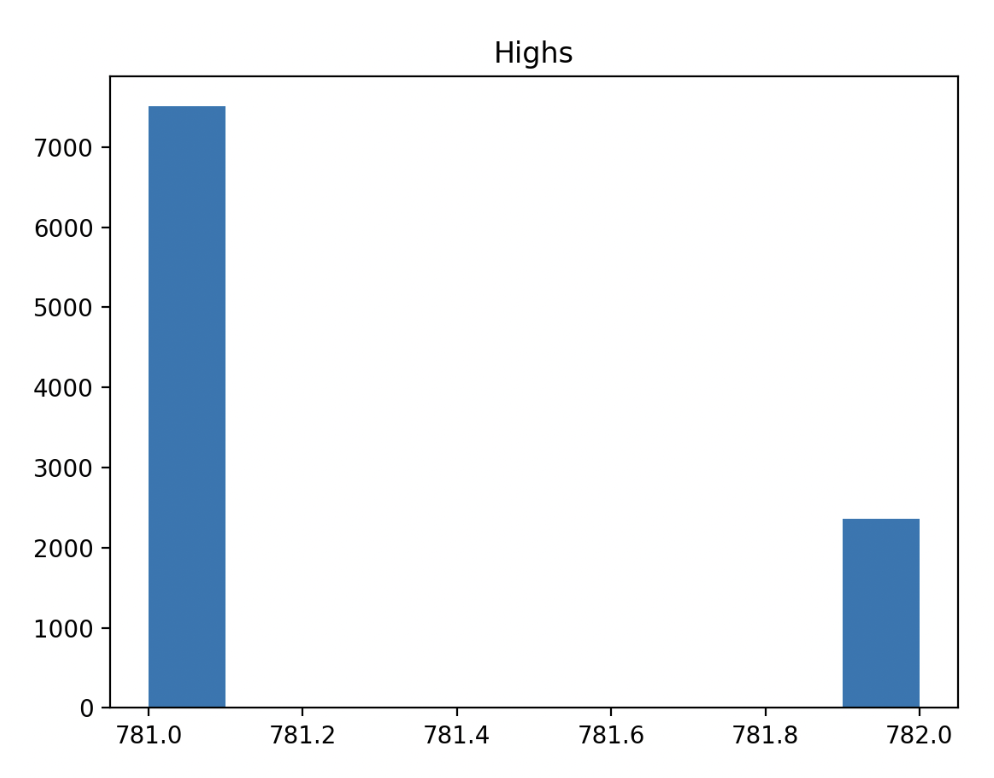

# Atmsospheric Dust Morphology Characterization

<figure class="center-figure">
    
    <figcaption></figcaption>
</figure>

Onboard the Cornell Rocketry Team's (CRT) 2025 competition rocket was a first-of-its-kind payload that collected lower-atmospheric dust and analyzed its size distribution using entirely an entirely custom venturi scrubber and coulter counter, all within a 4U cubesat formfactor (10cm x 10cm x 40cm).

I came up with the project idea, performed all preliminary feasbility studies, and managed mechanical design and integration of the system. I entirely owned the collection chamber, coulter counter, analysis PCBs, and power distribution module. I also designed and built the superstructure of the payload, and the mounting structure to incorporate payload into the rocket's airframe. Other members of CRT (Bridget McAvoy, Isaac Kahn, and Akshitha Jupally) designed and built the venturi scrubber, ducting, and air valves.

I also built my own 100 ft^2 cleanroom and class 1 clean-box to process dust sensitive hardware free of contamination. More details on this cleanroom are presented below. 

Payload was launched in June '25 on a rocket which came down ballistic (due to an unrelated parachute deployment issue), leading to catastrophic loss of onboard data and damage to the system. 

## System Overview

*A 40-page technical report is availible at the bottom of this page going into every aspect of my design of the payload. I recommend checking that out for further insight into the project.*

<figure class="center-figure">
    
    <figcaption></figcaption>
</figure>

The 2025 payload contains three subsystems, which work in order to capture, collect, and analyze dust in the lower atmosphere.

<u>Ducting</u>

The tip of CRT's 2025 rocket has a 1" hole sealed by an inertially-triggered mechanical valve. During high acceleration liftoff of the rocket, the valve springs open allowing impinging air on the rocket to enter the nose cone. A large duct transfers air from the tip to the payload body, ~18" below.

<figure class="center-figure">
    
    <figcaption>Cross section of the dust sampler installed in the nose cone</figcaption>
</figure>

<u>Venturi Scrubber</u>

Dust-laden-air enters a venturi scrubber, which uses a high-pressure water pump to atomize a saline solution, spraying millions of microdroplets into the air stream. Inertia of the dust particles causes them to collide with and absorb into the droplets, which are forced through a constrict throat to further promote mixing. Droplets are collected before "clean" air escapes out the side of the rocket.

<figure class="center-figure">
    
    <figcaption>Early version of the venturi scrubber and integrate saline storage tanks. The final design (pictured in cross section above) was done by Bridget McAvoy.</figcaption>
</figure>

<u>Collection and Analysis</u>

A spherical collection tank collects impinging droplets and stores them for later anlaysis. The tanks in-and-out flow is regulated by a ball valve and miniature vacuum pump.

After the rocket lands, colloidal dust is pumped through a 20 μm ruby aperture whose impedance is monitored by a high frequency ADC. By comparing the peak impedance of particles passing through the aperture to impedances of known particles, the volume of the particle can be determined. This analysis happens entirely within the cubesat.

<figure class="center-figure">
    
    <figcaption>Analysis section while being assembled in the frame</figcaption>
</figure>

<figure class="center-figure">
    
    <figcaption>Closeup of my power distribution board installed in the airframe</figcaption>
</figure>

<u>Supporting System</u>

A 4-post aluminum frame efficiently housed all components while still allowing for design changes late in the development process. A high power (20+ amps) PCB and corresponding battery pack provided power to the vacuum pump, high presure pump, ball valve, and analysis board. To integrate the payload with the rest of the rocket, there was also a custom metal nosecone tip, duct supporting hardware, and a bulkhead.

## Cleanroom
To handle contaimination-sensitive components, I built my own 100 ft^2 cleanroom with a smaller, class 1 glove box for the most sensitive parts. First, I cleaned out a room in an off-campus laboratory (HVL) sealing windows and removing large contaiminats which could shed particles. Then I sealed all walls, floors, and the cieling in a particulate free plastic wrap. I cut a flap in one of the plastic walls allowing for entry and exit. A small vestibule was formed between the plastic flap and the actual door to the room where I installed sticky mats to remove dirt from shoes and added an informal "gowning station" with gloves and wipes for decontaminating tools and equipment before bringing it into the cleanroom. 

<figure class="center-figure">
    
    <figcaption>Cleanbox inside my cleanroom</figcaption>
</figure>

The glove box was constructed with a 12"x12" HEPA box filter, variable speed fan, and modified storage container. An airlock on one side of the glove box allowed for passage of materials in and out of the glovebox without contaminating everything inside. The fan, lighting, and airlock components were designed to be compatable with any large storage container, allowing us to reassemble the glove box for use at competition. 

## High Frequency ADC
Based on a Teensy 4.1 microcontroller, I wrote a program which captures impedance values from the coulter counter with onboard ADC at high frequency and writes it directly to a MicroSD. 

I ultimately achieved a continous sampling rate of **1.339 Msps @ 12 bits**, no averaging (10 bits topped out at 1.5624 Msps, however the marginal increase in sampling frequency was not worth the 4x reduction in resolution). To achieve these high speeds, I used a DMA channel to save samples directly into one of two 512 byte buffers (ping pong buffer). Once full, each buffer would be saved to a pre-allocated spot on the SD while the DMA switched to saving to the alternate buffer. The program created a new file on the MicroSD every 11 seconds to minimize data loss on unexpected power down. 

To characterize the consistency of the sampling, measured a 1.000000 kHz square wave generated by a high-precision digital signal generator. I then wrote a python reanalysis program which creates a histogram of how many measurements per period (high or low) the ADC captured to intepret the timing consistency of the ADC relative to fixed interval signals. The results showed incredible stability in the sampling rate; both high and low periods had the same average number of samples to 5 digits. In otherwords, the 1.5624 Msps sampling frequency did not change even during buffer switches or other intermittent events. 

<figure class="center-figure">
    
    <figcaption>Histogram of number of samples taken during the low (500 ms) period of the square wave. Average is 781.25</figcaption>
</figure>

<figure class="center-figure">
    
    <figcaption>Histogram of number of samples taken during the high (500 ms) period of the square wave. Average is 781.25</figcaption>
</figure>

## Motivation

Most atmospheric dust analysis campaigns rely on weather balloons, aircraft, or satellites for their data collection and analysis. Each of these platforms have their own strengths and weaknesses. However, none can provide an altitude-segmented dust size and concentration for a single time/column of air.

Rockets are a prime platform for this kind of near-instant, perfectly vertical, sampling of the atmosphere. To the best of my knowledge, a system like this has never been created (or even attempted).

## Technical Report

Below is a detailed technical report I wrote for payload 2025, which dives deeper into all the systems I owned. It also contains all engineering drawings I created and screenshots of all components I designed. 

<object data="payload_2025_technical_report.pdf" type="application/pdf" width="500px" height="700px">
    <embed src="payload_2025_technical_report.pdf">
        
This browser does not support PDFs. Please download the PDF to view it: <a href="payload_2025_technical_report.pdf">Download PDF</a>.

    </embed>
</object>