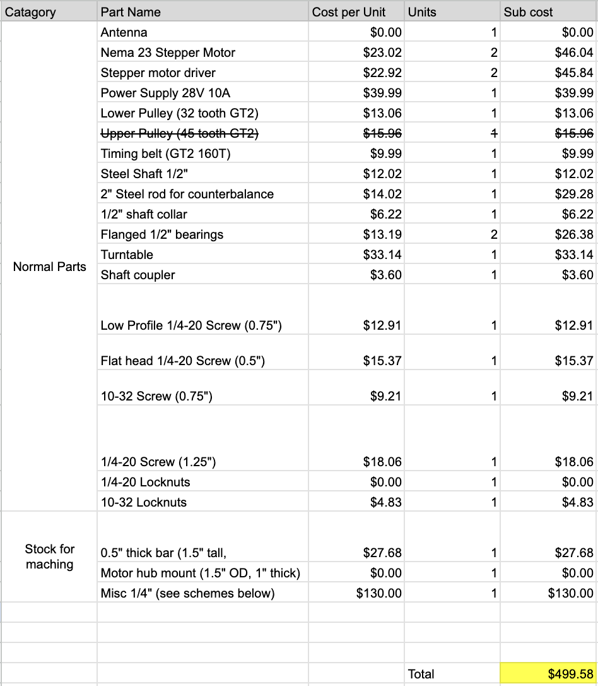
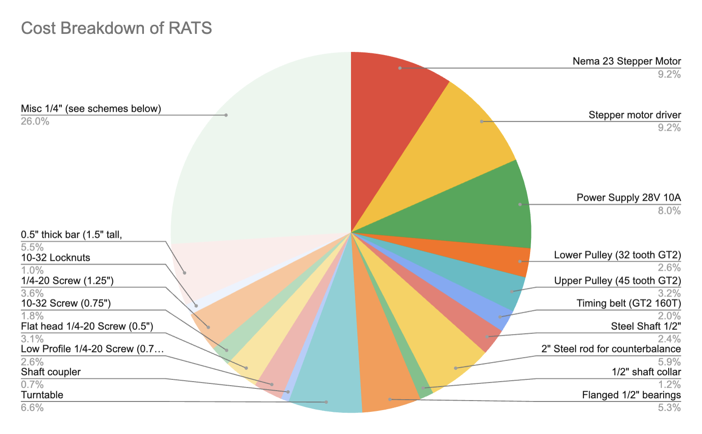
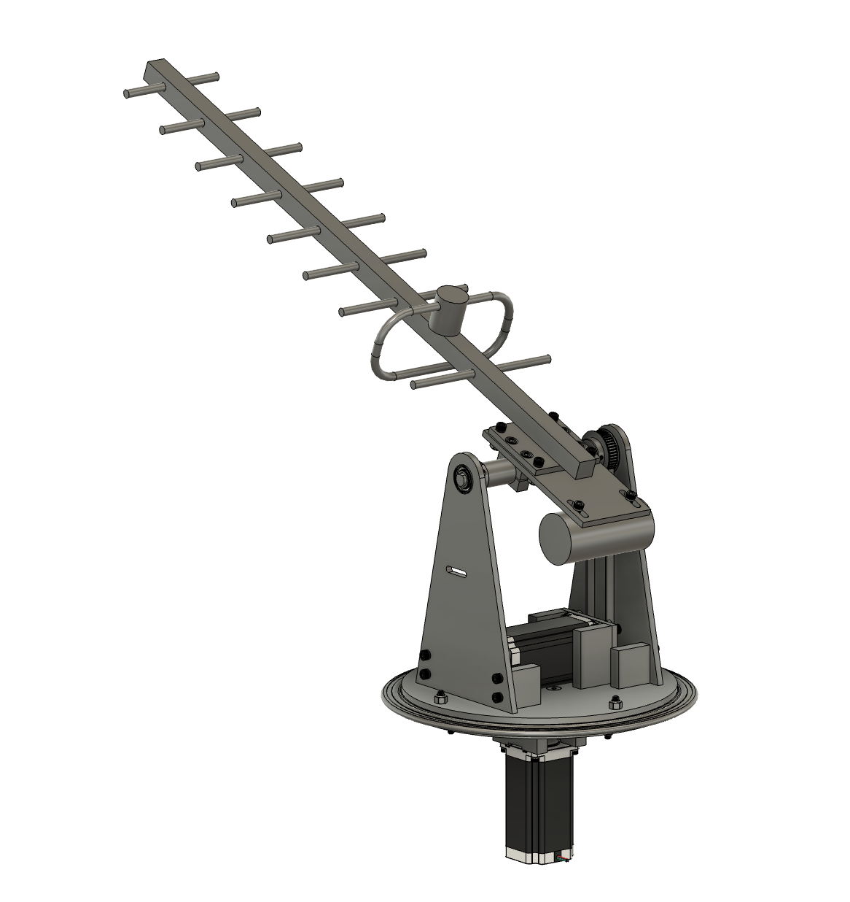
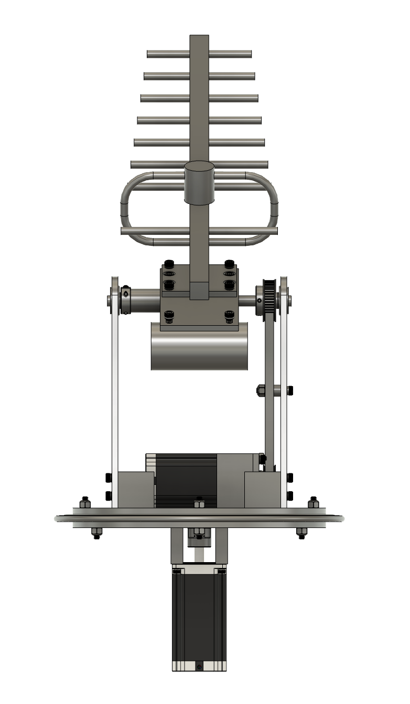
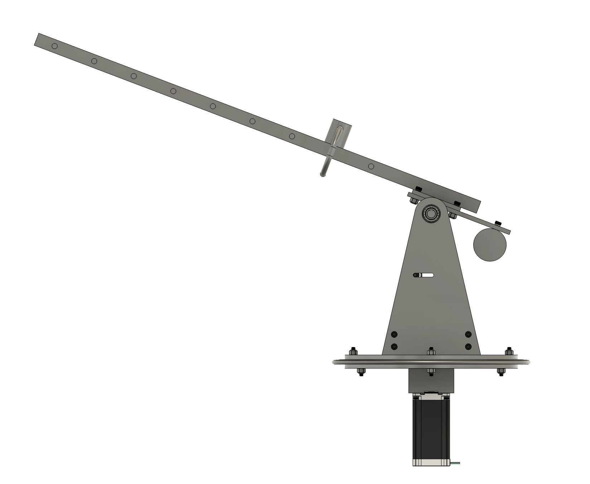
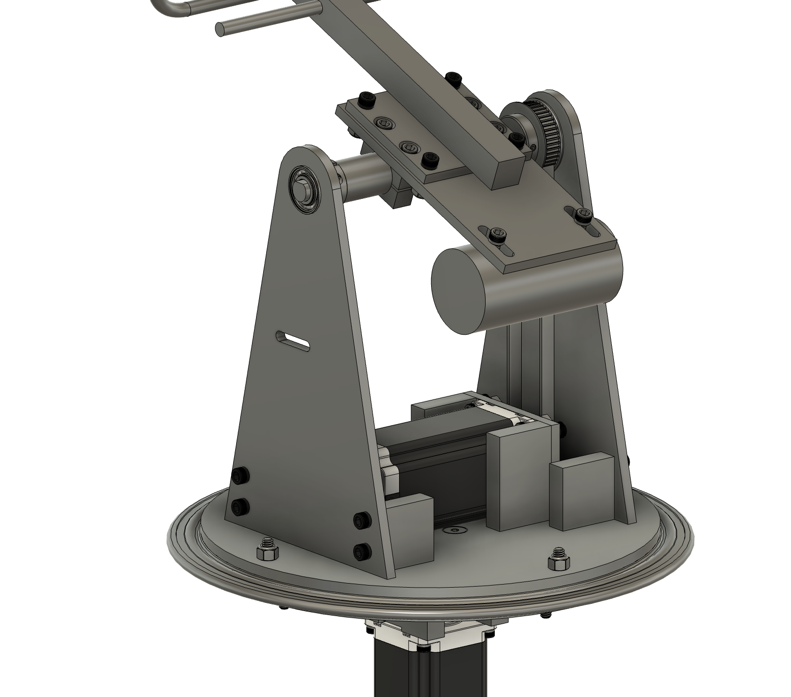
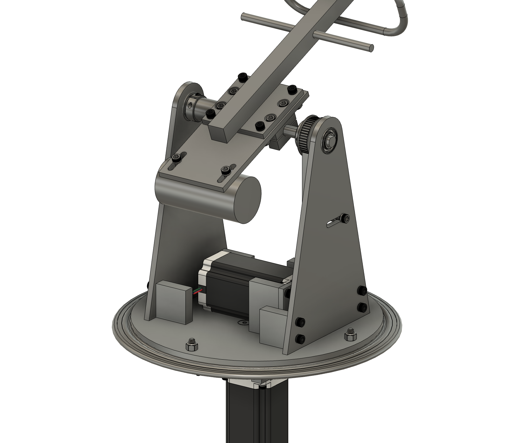
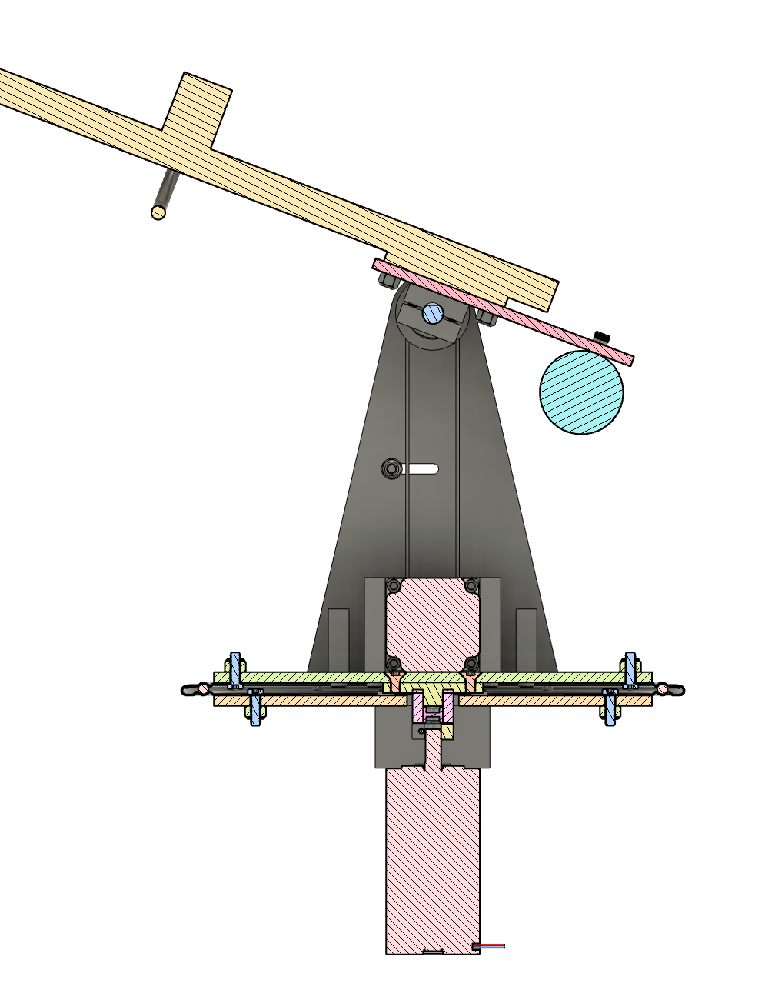

# RATS (Rotational Antenna Tracking System)

<figure class="center-figure">
    
    <figcaption></figcaption>
</figure>

RATS, the **R**otational **A**ntenna **T**racking **S**ystem, is a robotic turret with a yagi antenna on the end which automatically tracks the Cornell Rocketry Team's sounding rocket throughout its entire flight, allowing two way communication between the rocket and a ground station.

## System Overview

RATS uses two Nema 23 stepper motors to control the azimuth and altitude angles of the yagi. An adjustable counterweight ensures the system can operate with minimal vibrations even during high velocity events (like take-off). Due to rocket launches occuring in harsh desert environments—where temperatures can exceed 140° on the ground—RATS is constructed entirely from aluminum and steel.

RATS is designed to be as simple as possible; this goal of simplicity dominated all other considerations (like cost, portability, etc...) when making design decisions. An exemplar of this simplicity is the fact that all 12 brackets for RATS can be made from a single extrusion of 1-1/2" x 0.5" aluminum bar stock, hugely reducing machining time and required stock.

## Calculations
Below is the doc I used to calculate required torques, and ultimately justify my decisions for RATS' motors. While many of the assumptions are crude, they tend towards over-speccing the system. 

<object data="rats_system_design.pdf" type="application/pdf" width="500px" height="700px">
    <embed src="rats_system_design.pdf">
        
This browser does not support PDFs. Please download the PDF to view it: <a href="rats_system_design.pdf">Download PDF</a>.

    </embed>
</object>

&nbsp;

## Electromechanical Components

RATS uses the following components:
- Antenna: [Farnell YAGI-868/914A](https://www.farnell.com/datasheets/1580325.pdf)
- Motors: [Stepperonline E Series Nema 23 3.0Nm](https://www.omc-stepperonline.com/e-series-nema-23-bipolar-1-8deg-3-0-nm-425oz-in-4-2a-57x57x113mm-4-wires-23he45-4204s)
- Motor drivers: [Stepperonline DM556T](https://www.omc-stepperonline.com/digital-stepper-driver-1-8-5-6a-20-50vdc-for-nema-23-24-34-stepper-motor-dm556t)
- Power supply: [Generic 48v 10A AC-DC PSU](https://www.amazon.com/DROK-110V-220V-Converter-Adjustable-Transformer/dp/B08GFQZFC1)

## Complete BOM
*Includes the electromechanical components listed above.*
*Items with a cost of $0.00 were already owned.*

The system came out to a toal cost of ~$500 (not including cost of antenna).

<figure class="center-figure">
    
    <figcaption>Complete BOM for RATS</figcaption>
</figure>

<figure class="center-figure">
    
    <figcaption>Pie chart cost breakdown of RATS</figcaption>
</figure>

## CAD Renderings of the System

<figure class="center-figure">
    
    <figcaption></figcaption>
</figure>

<figure class="center-figure">
    
    <figcaption></figcaption>
</figure>

<figure class="center-figure">
    
    <figcaption></figcaption>
</figure>

<figure class="center-figure">
    
    <figcaption></figcaption>
</figure>

<figure class="center-figure">
    
    <figcaption></figcaption>
</figure>

<figure class="center-figure">
    
    <figcaption></figcaption>
</figure>

## Machining Drawings
RATS had many machined components, which required 12 seperate drawings for our machinists. All of them have been compiled into the following PDF. 

<object data="rats_complete_drawings.pdf" type="application/pdf" width="500px" height="700px">
    <embed src="rats_complete_drawings.pdf">
        
This browser does not support PDFs. Please download the PDF to view it: <a href="rats_complete_drawings.pdf">Download PDF</a>.

    </embed>
</object>
