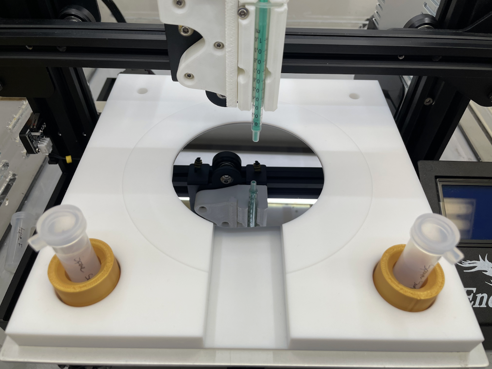
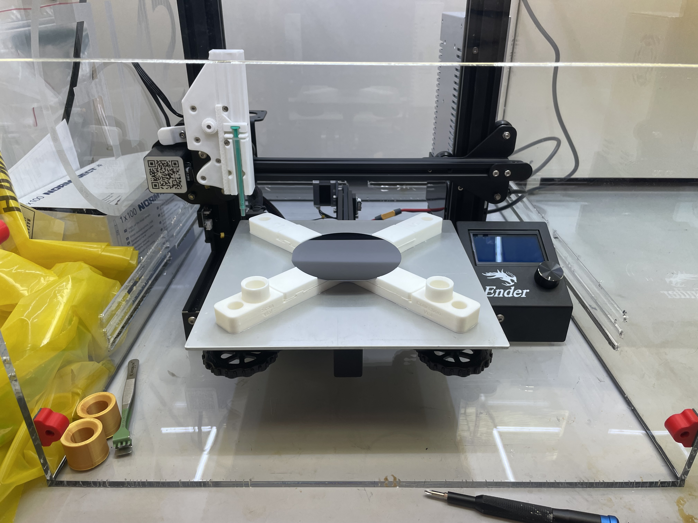
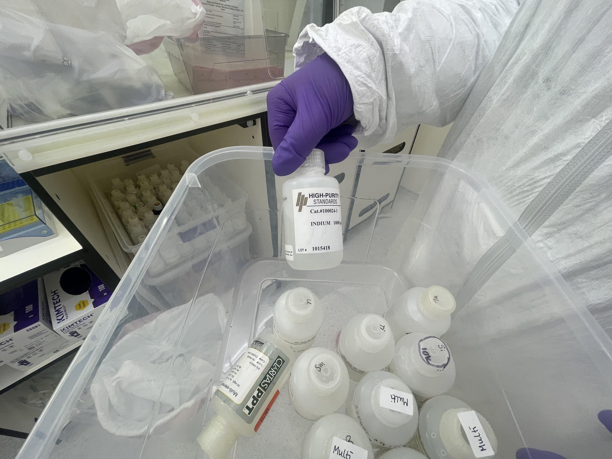
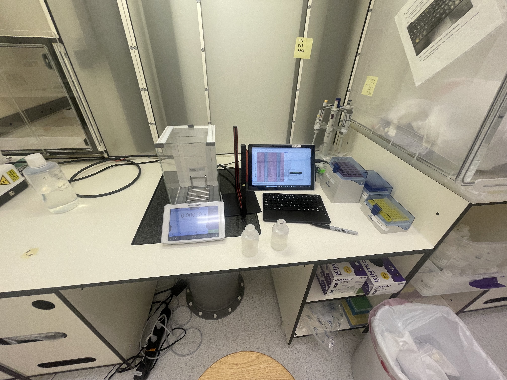
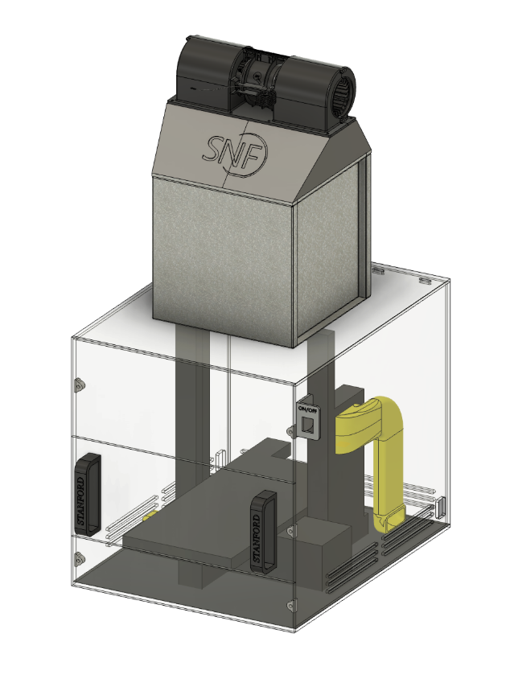

# Femtogram Metal Contaminant Detection with Vapor Phase Decomposition (Stanford Nanofab)

<figure class="center-figure">
    
    <figcaption></figcaption>
</figure>

During summer '24, I worked at the [Stanford Nanofabrication Facility (SNF)](https://nanolabs.stanford.edu/) designing, building, and testing a droplet-based vapor phase decomposition (VPD) tool to detect trace metal contaminants on the surface of silicon wafers. Not only did the device use a novel approach to VPD to minimize hydrofluoric acid (HF) vapors, but it's the first DIY VPD in use at a functioning nanfab to the best of my knowledge. 

The device is now installed in the Stanford Nanofab and can be used by trained staff to check the contamination levels within their atomic layer deposition (ALD) tools across 33 different elemental contaminants.

## Background on VPD and ICPMS
VPD (vapor phase decomposition) is a technique to collect metal and chemical contamininats on the surface of a wafer into a liquid droplet. Traditionally, VPD was performed by dispensing an H2O2/water/HF droplet on the surface of a wafer which has already been attacked by HF vapor and manually rolling the droplet around by tilting the wafer until the droplet has traversed the entire wafer surface. Then, the droplet is aspirated for analysis. To be clear, VPD does not involve the measurement or quantification of chemicals; it's simply a technique (among many) to collect them. That's where ICP-MS comes in...

ICP-MS stands for "Inductively Coupled Plasma Mass Spectroscopy." It's one of the most sensitive techniques for measuring the concentration of metals and other chemicals in liquid solutions. A liquid sample is aerosolized before getting ionized by a plasma. Metals in the solution are then sorted and counted based on their charge/mass ratio.

When VPD and ICP-MS are combined, it's called VPD-ICP-MS. Note that VPD doesn't necessarily need to use ICP-MS for analysis; alternatives like Atomic Absorption Spectroscopy (AAS) are also common. Similarly, VPD is not the only way to collect samples for ICP-MS; anything from blood to seawater to colloidal space dust can be measured in an ICP-MS.

## The Device

The VPD scanner is based on a modified 3D printer; instead of a hot-end to extrude plastic, it has a motor-controlled syringe. To scan a wafer, the syringe first aspirates ~200 uL of an HF/H2O2/Water solution. Then it lowers to the surface of the wafer and dispenses the solution, forming a droplet on the surface of the wafer. Crucially, the droplet remains connected to the tip of the syringe. Over the course of 5-15 minutes (depending on wafer size), the scanner slowly moves the syringe head in a series of expanding concentric rings, dragging the droplet across the entire surface of the wafer. 

The HF in the scan solution attacks the ~2nm native oxide on the wafer's surface, dissolving any contaminants on the surface (and first few layers of SiO2). Finally, the scanner sucks up the droplet from the surface and dispenses it in a collection cuvette, for later analysis by an ICP-MS.

<figure class="center-figure">
    
    <figcaption>Final device insalled in the SNF cleanroom</figcaption>
</figure>

<figure class="center-figure">
    
    <figcaption>Modified wafer chuck for hot-swapping between different sized wafers</figcaption>
</figure>

## Generating Scan Routines
Different scan routines are needed for different sized wafers at different sensitivies. Certain droplet chemistries also limit the adhesion of the droplet to the syringe, requiring the droplet height, volume, and scan speed to be adjusted. 

I wrote a Python script which generates scan routines based on a user's wafer and scan parameters. I also wrote a Python framework which allows users to create fully custom scan routines (i.e. for rectagular samples, parameter sweeps, etc...) using easy-to-understand block commands. The framework ensures that the final, compiled G-CODE program does not risk crashing the syringe into the wafer or any sample cuvettes on the loading tray.

## Droplet Chemistry
I worked closely with Karrie Weaver and Kathleen Akbar at the [SIGMA lab](https://sigmalab.stanford.edu/) to develop a droplet chemistry and ICPMS protocol to detect as many elements as possible with the limited (<1 ml) droplet volume. 

Ultimately, we were able to come up with a routine to succesfully characterize the following 33 elements:

Li, Be, Mg, Al, K, Ca, Mn, Fe, Co, Ni, Cu, Zn, Ga, As, Se, Sr, Ru, Rh, Pd, Ag, Cd, Sn, Te, Cs, Ba, Hf, Ta, W, Ir, Pt, Au, Tl, Pb

Detection limits on many elements were as low as 1 picogram / mL. 

<figure class="center-figure">
    
    <figcaption></figcaption>
</figure>

<figure class="center-figure">
    
    <figcaption>Working with Karrie in the SIGMA metal-free cleanroom to prepare a standard elemental solution to calibrate the ICPMS against</figcaption>
</figure>

## Sources of Contamination
I spent considerable time characterizing all possible sources of contaminants in exhaustive sampling campaigns with an ICPMS. Some of the many experiments included:

- Contamination of H2O2, HF, and H2O precursors
- Contamination of cleanroom air
- Contamination of Savillex Perfluoroalkoxy jars and cuvettes
- Contamination of droplets caused by chemicals leaching out of the syringe
- Effects of bottle opening technique on contamination
- Cuvette cleaning techniques impact on contamination
- Recovery percentages of metal contaminants on wafer surface

<figure class="center-figure">
    
    <figcaption>Working with Karrie in the SIGMA metal-free cleanroom to prepare a standard elemental solution to calibrate the ICPMS against</figcaption>
</figure>

## ULPA Enclosure

Due to the presence of trace metal contaminants in the cleanroom air, I designed and built a secondary ULPA-filtered enclosure to house the scanner. This not only ensured all air passing over the scanner was 100% free of metal contaminants, but it also protected users from unintentional HF splashes and vapors. 

<figure class="center-figure">
    
    <figcaption>CAD rendering of the scanner inside its ULPA filtered enclosure</figcaption>
</figure>