# Trail Running Dolomites (June '23) 

<figure class="center-figure-big">
    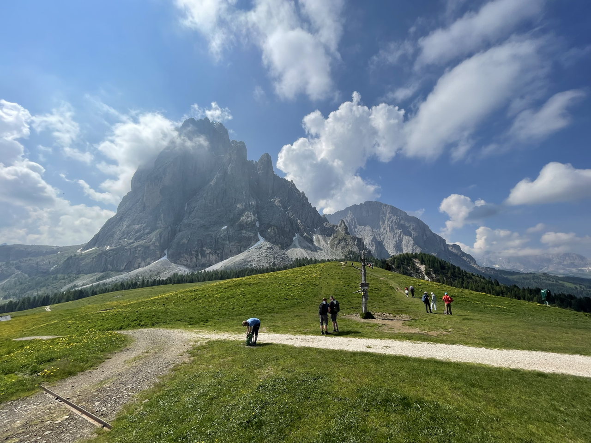
    <figcaption></figcaption>
</figure>

## Getting There
Flew into Munich. Spent several days in Germany before driving through Innsbruck to the Dolomites. Stayed at the Dorfhotel Beludei.

## The Run

Walked from the hotel down to the valley floor. Took two successive chairlifts back up the other side of the valley (purchase tickets at the bottom of the first when I showed up in the morning). Started my run from the top of the second chairlift. 

The first ~5 miles I skirted around the eastern base of the large rock towers. At mile 5.4, I stopped at Rifugio Sandro Pertini for water, before heading turning back.

On my way back, I noticed a switchback trail up the middle of the rock tower. I decided to run up it, at which point a thunderstorm moved in and drenched me in freezing rain. I tried to warm up in the Rifugio Toni Demetz Hütte at the top but continued to get colder. 

I therefore decided to take the tram down (purchased a ticket at the top). The cabins are single person. During the ride down, lightning struck one of the towers and the tram was temporarily paused.

When I got to the bottom, I ran through the rain back to the hotel. Fortunately, it subsided. When I reached the top of the chairlifts, I decided to run down the ski runs that the lifts climbed up. In retrospect, I think this was not allowed. Nonetheless, I reached the valley floor and climbed back up the otherside, reaching the hotel.

The run was ~17 miles, with 6,000 feet of climbing. [Strava](https://www.strava.com/activities/9295106687)

## Advice
- When running in the mountains, always be prepared for a thunderstorm, even if it's not in the forecast
- Do not let yourself get drenched when running, unless you are close enough to the finish that you're positive you can make it without stopping
- I'm fairly certain the ski slopes are off limits in the summer; I would stick to the chairlifts when returning to the valley floor
- There are plenty of huts along the route for food and water
- The Dorfhotel Beludei is the best hotel I've ever stayed at, and I cannot recommend it enough

## Photos

<figure class="center-figure">
    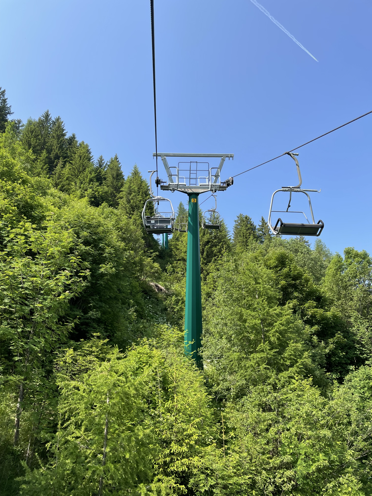
    <figcaption>Riding the chairlift up</figcaption>
</figure>

<figure class="center-figure">
    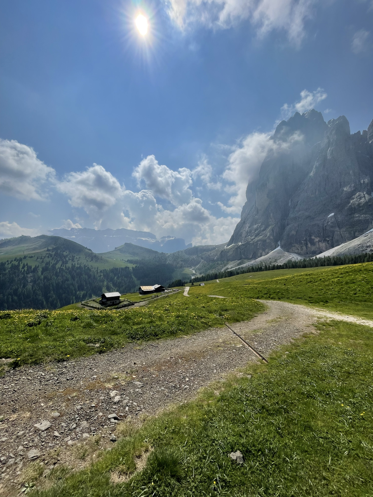
    <figcaption></figcaption>
</figure>

<figure class="center-figure">
    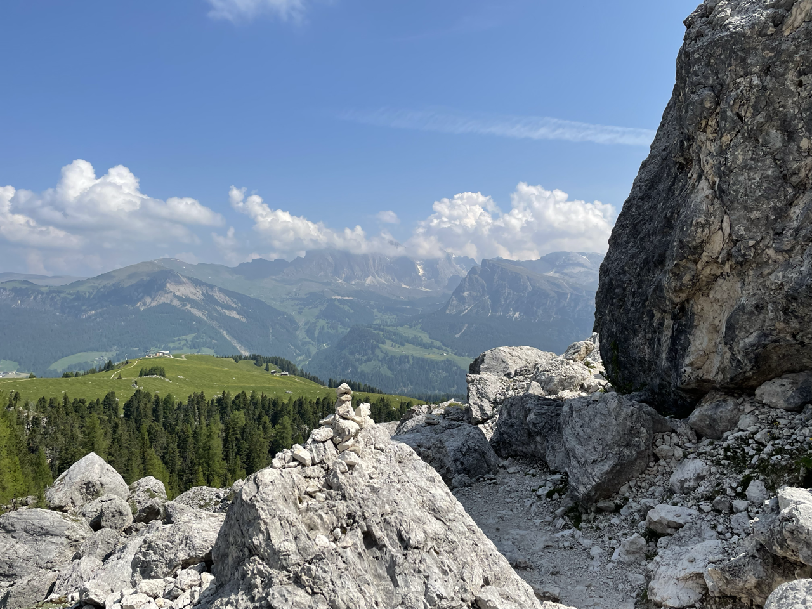
    <figcaption></figcaption>
</figure>

<figure class="center-figure">
    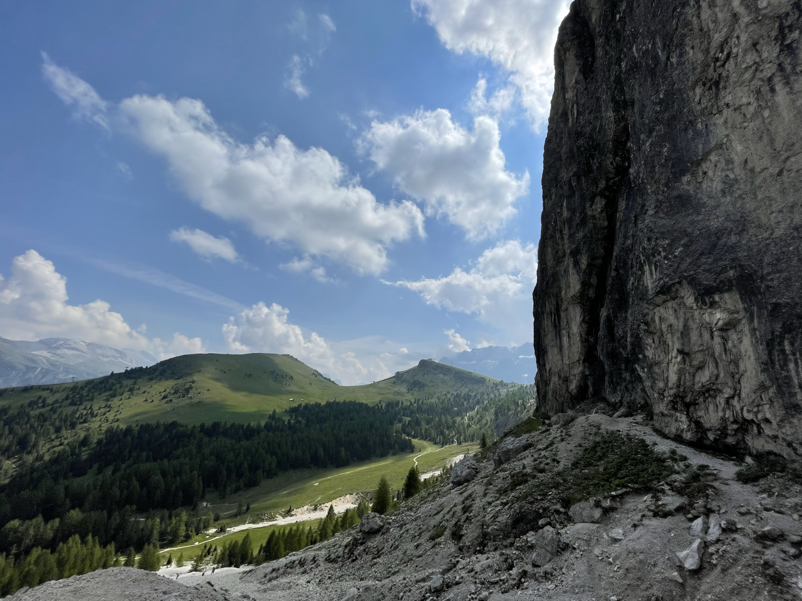
    <figcaption></figcaption>
</figure>

<figure class="center-figure">
    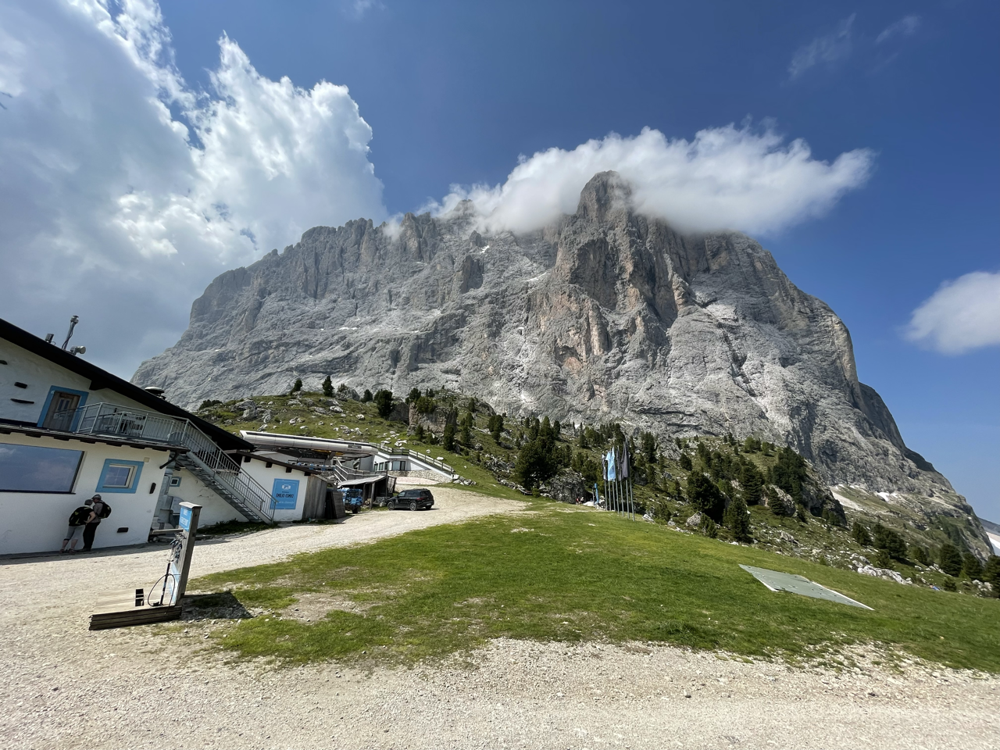
    <figcaption></figcaption>
</figure>

<figure class="center-figure">
    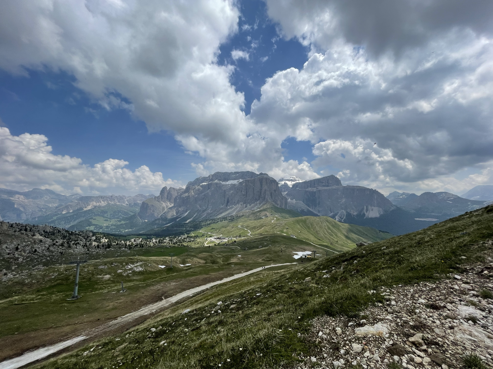
    <figcaption></figcaption>
</figure>

<figure class="center-figure">
    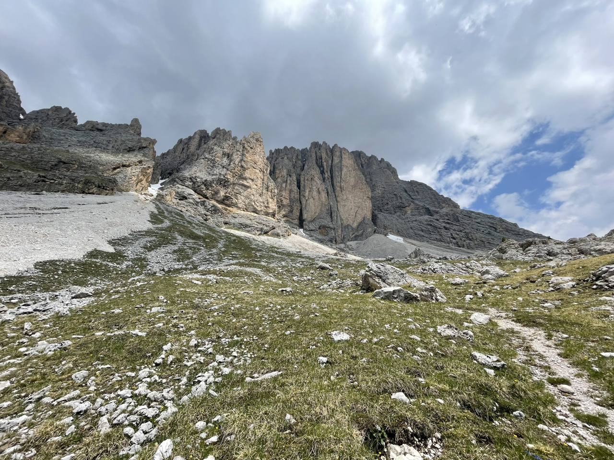
    <figcaption></figcaption>
</figure>

<figure class="center-figure">
    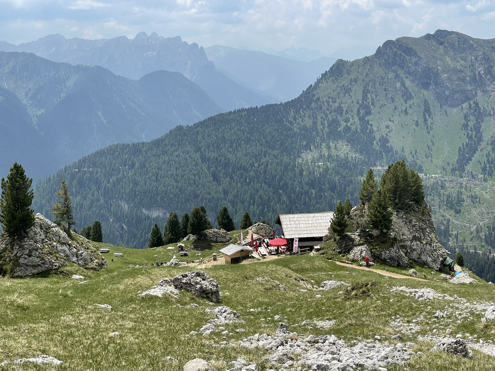
    <figcaption></figcaption>
</figure>

<figure class="center-figure">
    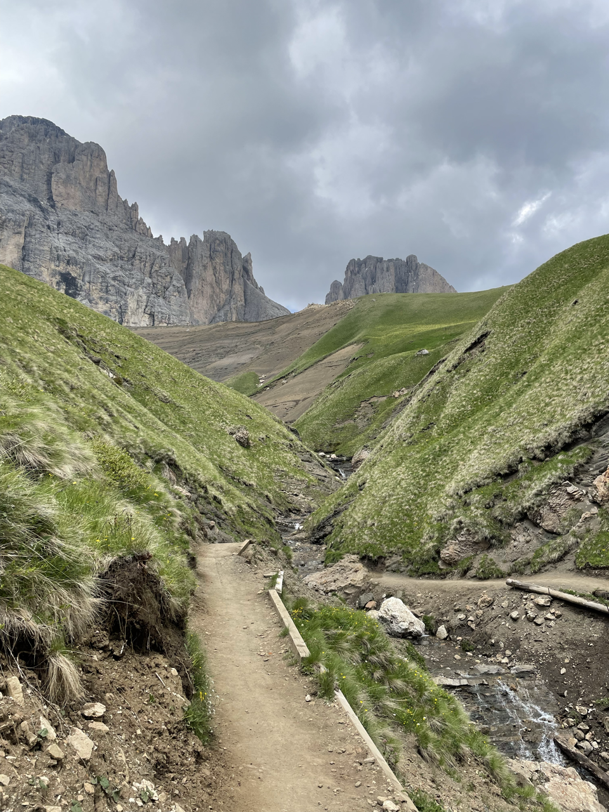
    <figcaption></figcaption>
</figure>

<figure class="center-figure">
    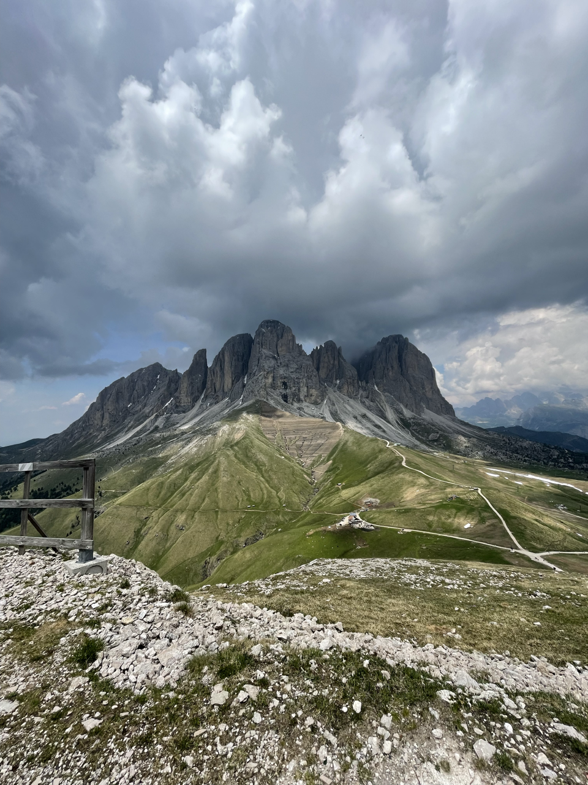
    <figcaption></figcaption>
</figure>

<figure class="center-figure">
    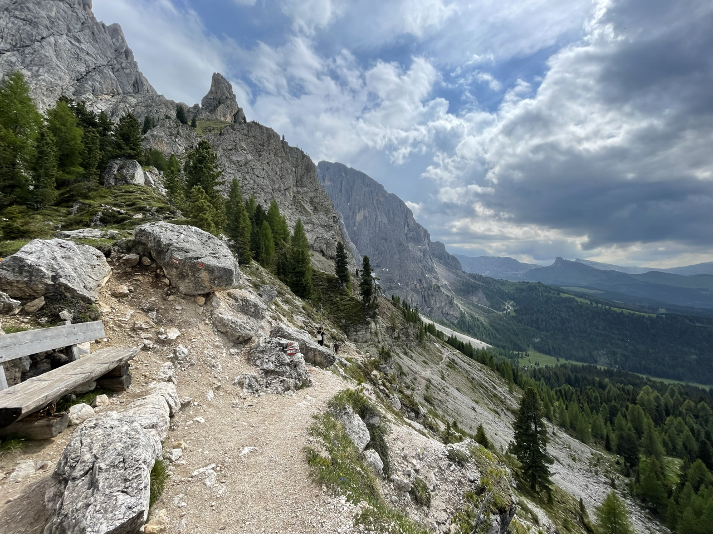
    <figcaption></figcaption>
</figure>

<figure class="center-figure">
    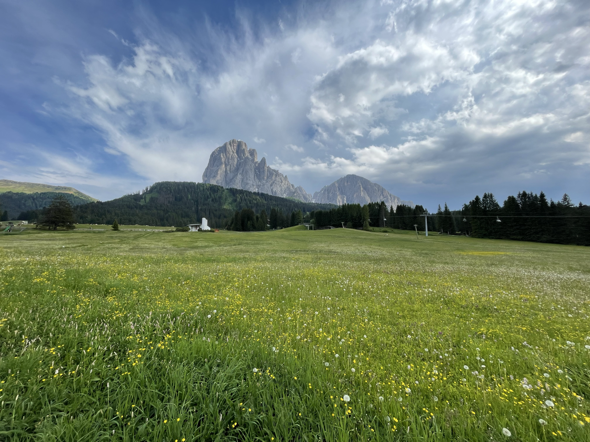
    <figcaption></figcaption>
</figure>