# Tahiti Spines (April '23) 

<figure class="center-figure-big">
    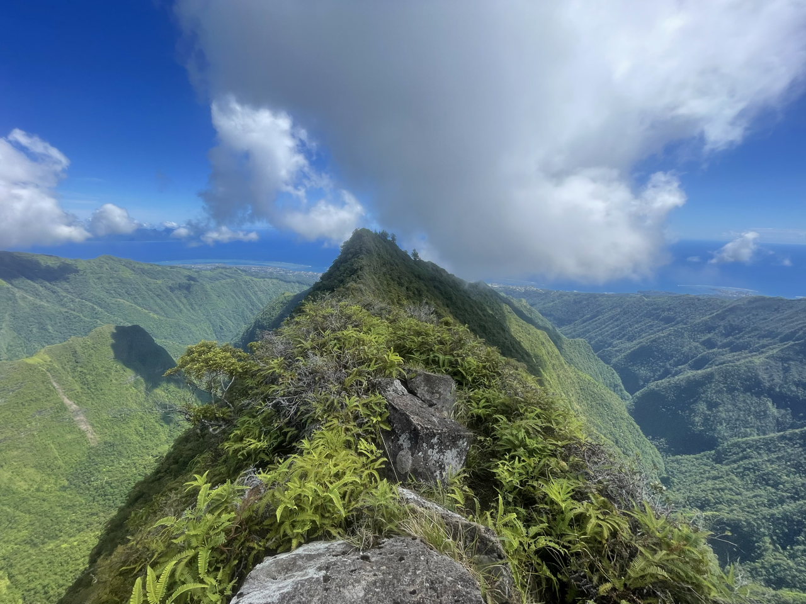
    <figcaption></figcaption>
</figure>

## Getting there

Flew into Papeete from SFO, landed in the evening. Walked from the airport to the Intercontinental. Had dinner at the hotel restaurant.

## The Run

Took a taxi from hotel to [this](https://maps.app.goo.gl/FzsMxbTej9sbHq9u5) parking lot. It was very humid, and temperature rose from 80° in the morning well into the high 90s by the afternoon. The UV index was topped out.

The first 3.4 miles was just running up the dirt road to the start of the trail, which is next to the restaraunt O Belvédère.

I took the trail for ~6.7 miles up. The first ~4 were relatively tame, after which the trail climbed up onto a ~3-6 foot wide ridge with 1,000' to 2,000' drops on either side. Many sections had rope to hold on to in case you slipped. 

4.4 miles into the trail (7.8 into the run) was Fare Mato, a very basic emergency shelter.

I turned around after I ran out of water. I stopped by O Belvédère on the way down to refill on water from their kitchen.

At this point, I was roughly 12 miles into the run. I did not have enough cash for a taxi back, so I made the decision to run back to the hotel. This was a mistake; in retrospect I should have called the hotel and gotten a taxi.

It was an additional 16 miles from the trail head back to the hotel. This was through urban Tahiti, running on sidewalks, through industrial parks, and at one point along a freeway. I was hit by a car while running in the suburbs. I stopped for apple juice at a gas station ~3 miles away from the hotel.

After getting back to the hotel I succumbed to heat stroke and was unable to move for several hours. I rested that evening before flying back the following afternoon.

The run came in at ~28 miles, with 5,200 feet of climbing. [Strava](https://www.strava.com/activities/8810775540)

## Advice
- I should have had the taxi drop me off at O Belvédère (the trail head), not the start of the dirt road
- Carry as much water as physically possible; despite having several liters it was not enough
- I should have stopped the run after reaching the end of the dirt trail. Running through Urban Tahiti was not enjoyable
- My legs had hundreds of cuts and gashes from thorns; wear long pants or be prepared for cuts from the bushes

## Photos

<figure class="center-figure">
    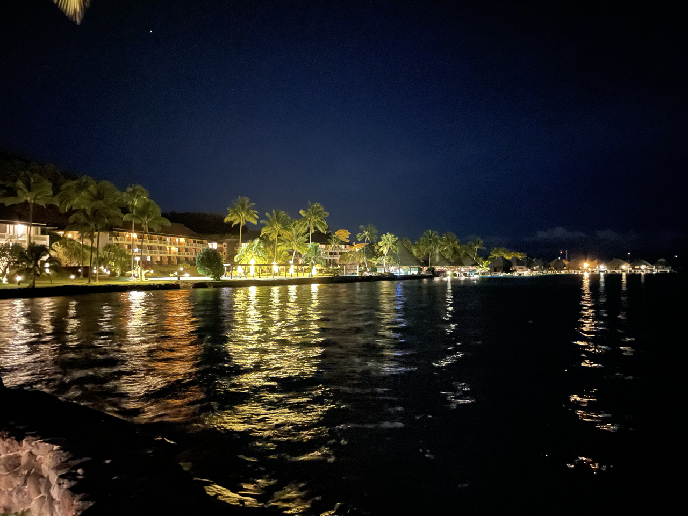
    <figcaption>Hotel at night</figcaption>
</figure>

<figure class="center-figure">
    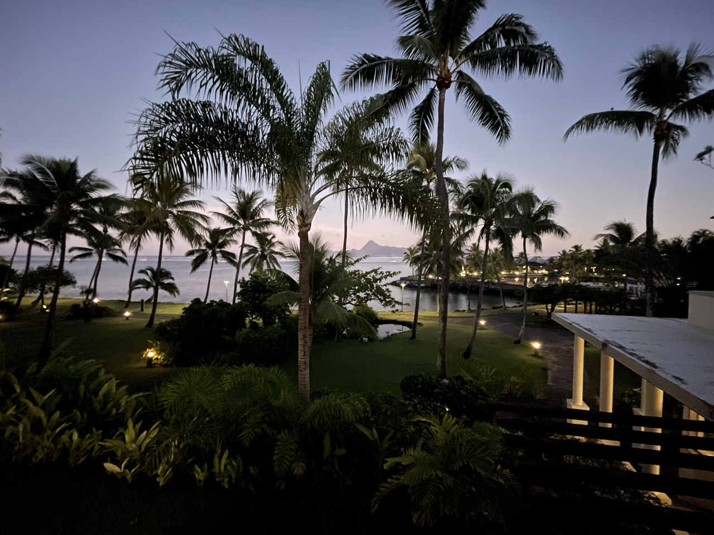
    <figcaption>View from my room in the morning</figcaption>
</figure>

<figure class="center-figure">
    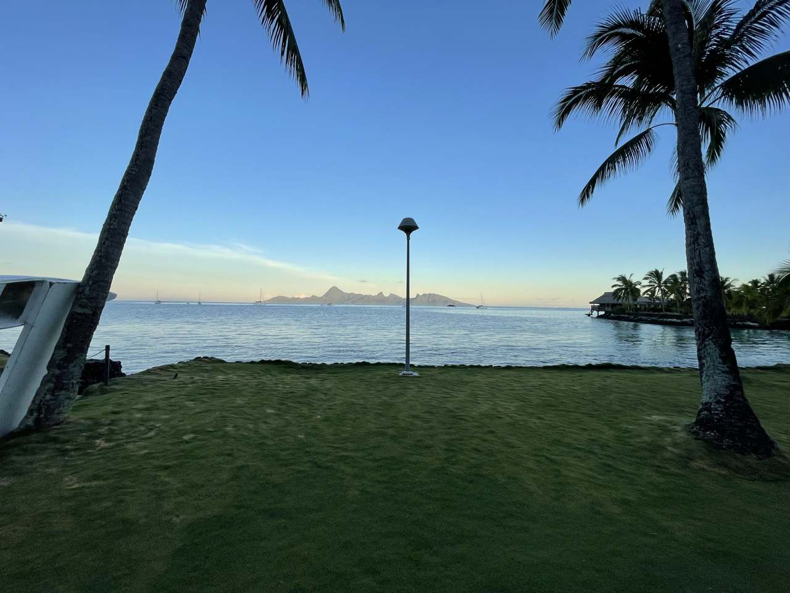
    <figcaption></figcaption>
</figure>

<figure class="center-figure">
    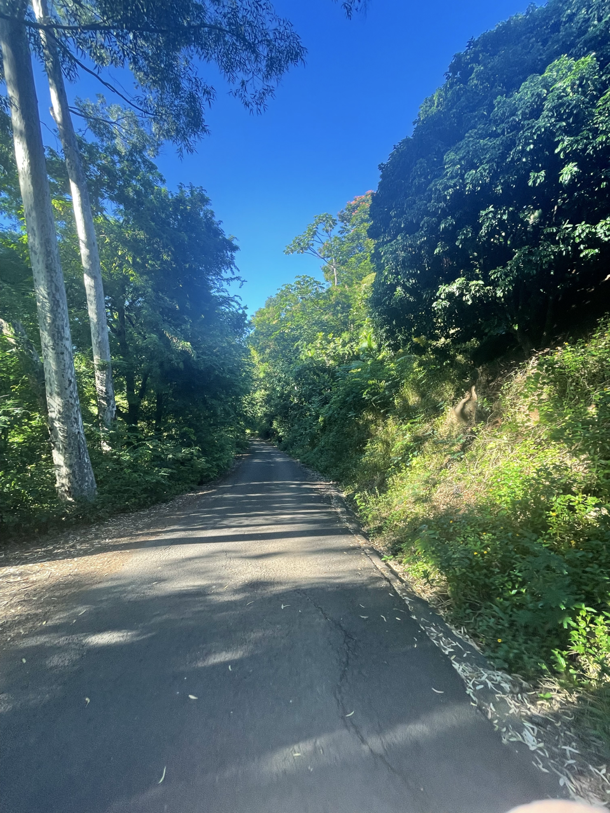
    <figcaption>Dirt/pavement road at beginning</figcaption>
</figure>

<figure class="center-figure">
    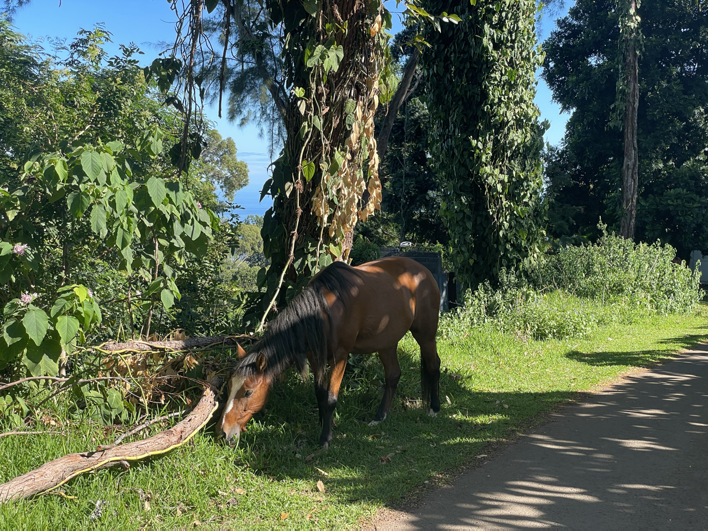
    <figcaption>Horse on the way up</figcaption>
</figure>

<figure class="center-figure">
    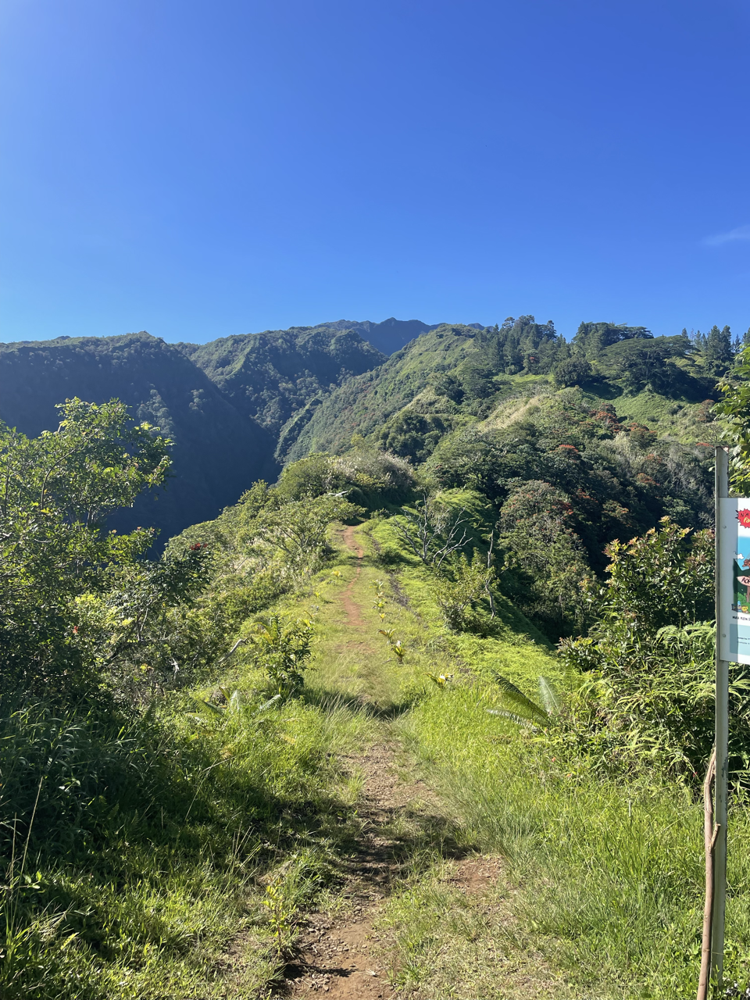
    <figcaption>Start of the trail</figcaption>
</figure>

<figure class="center-figure">
    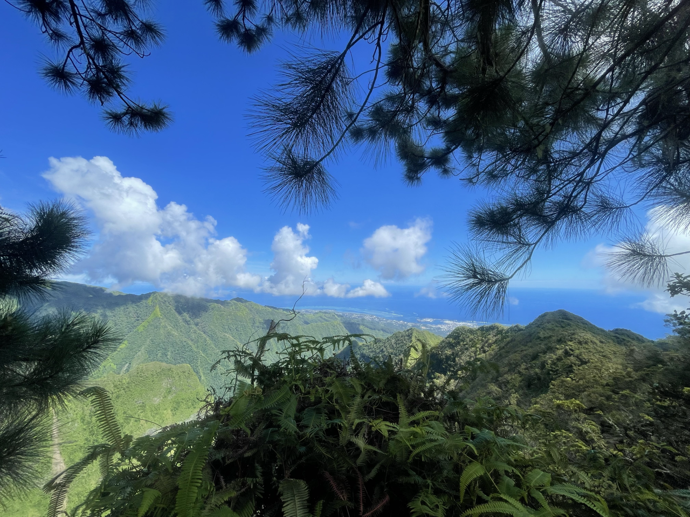
    <figcaption>Beginning to get up high</figcaption>
</figure>

<figure class="center-figure">
    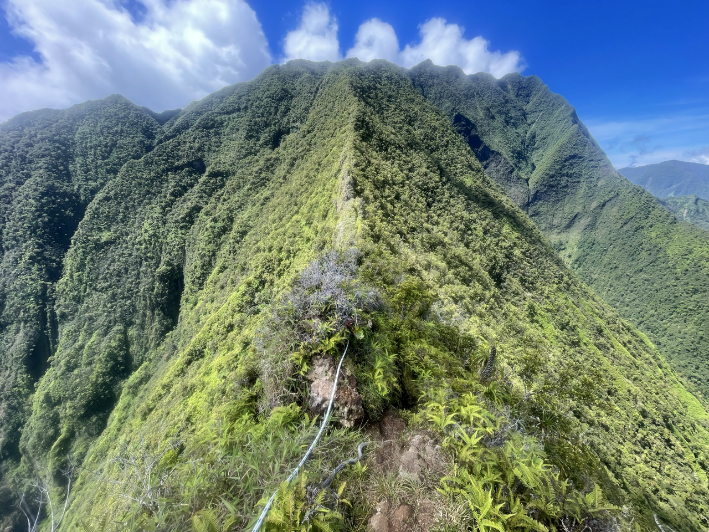
    <figcaption>Hairline ridge</figcaption>
</figure>

<figure class="center-figure">
    
    <figcaption>Looking back towards the ocean</figcaption>
</figure>

<figure class="center-figure">
    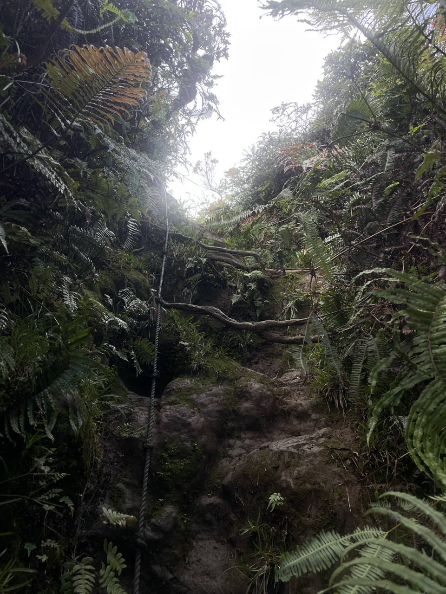
    <figcaption>Roped up section along edge of ridge</figcaption>
</figure>

<figure class="center-figure">
    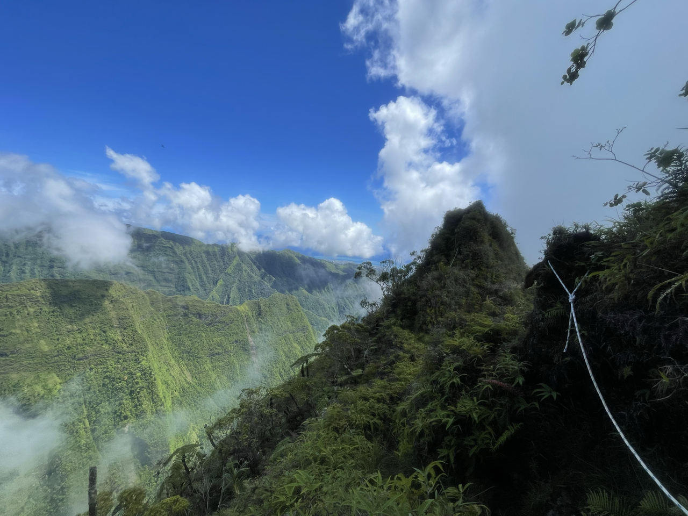
    <figcaption>Another roped up section along edge of ridge</figcaption>
</figure>

<figure class="center-figure">
    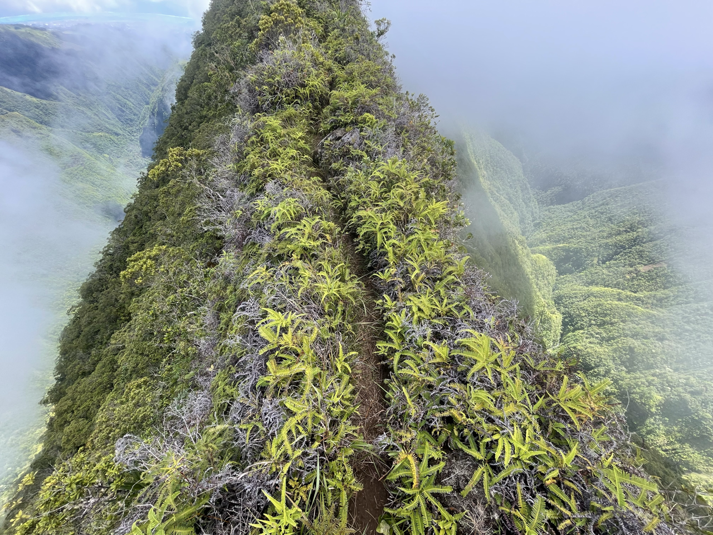
    <figcaption>More hairline ridge</figcaption>
</figure>